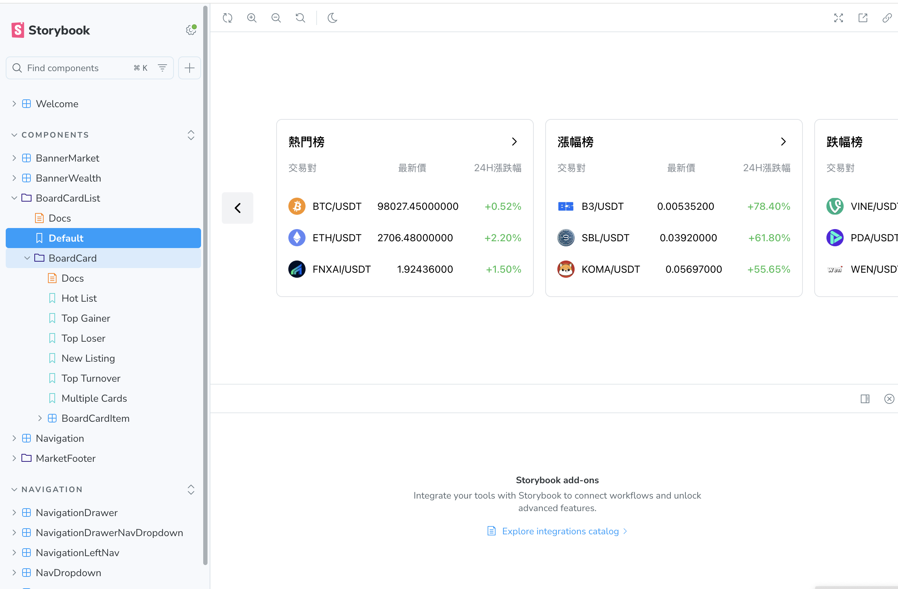
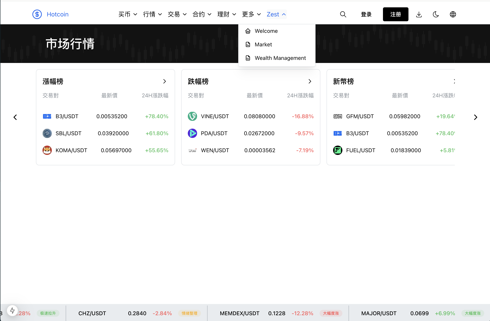

# HotCoin interview

初中级面试题
https://www.hotcoin.com/zh_CN/market
https://www.hotcoin.com/zh_CN/wealthManagement

基于线上两页面，自己重新写一份这两页面功能（线上页面存在诸多设计不合理之处，请勿照抄）。

注意事项：
时间关系无需开发导航栏（加个深浅版切换按钮即可,右上角导航月亮/太阳图标）
页面数据可复制线上数据mock接口数据
需要注意切换主题（右上角导航月亮/太阳图标可切换深浅版）
兼容现代浏览器即可
需要用到的静态文件（图片图标等）直接抓取线上页面
可使用第三方库
注意页面还原度

考察重点：
html，css基本功。
合理的css架构。
代码维护成本
组件化思维（初级工程师不做要求，中级酌情考察）
React技术栈使用（初级工程师不做要求，中级酌情考察）

## Storybook

## Market

Please navigate the page with the dropdown of Zest to go to

1. welcome
2. market
3. wealthManagement

## Features

This template comes with the following features:

- [PostCSS](https://postcss.org/) with [mantine-postcss-preset](https://mantine.dev/styles/postcss-preset)
- [TypeScript](https://www.typescriptlang.org/)
- [Storybook](https://storybook.js.org/)
- [Jest](https://jestjs.io/) setup with [React Testing Library](https://testing-library.com/docs/react-testing-library/intro)
- ESLint setup with [eslint-config-mantine](https://github.com/mantinedev/eslint-config-mantine)

## npm scripts

### Build and dev scripts

- `dev` – start dev server
- `build` – bundle application for production
- `analyze` – analyzes application bundle with [@next/bundle-analyzer](https://www.npmjs.com/package/@next/bundle-analyzer)

### Testing scripts

- `typecheck` – checks TypeScript types
- `lint` – runs ESLint
- `prettier:check` – checks files with Prettier
- `jest` – runs jest tests
- `jest:watch` – starts jest watch
- `test` – runs `jest`, `prettier:check`, `lint` and `typecheck` scripts

### Other scripts

- `storybook` – starts storybook dev server
- `storybook:build` – build production storybook bundle to `storybook-static`
- `prettier:write` – formats all files with Prettier
